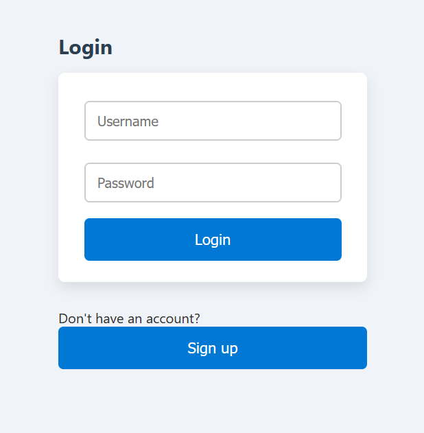
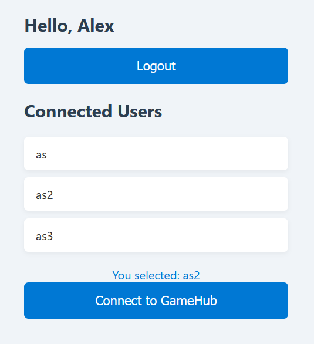
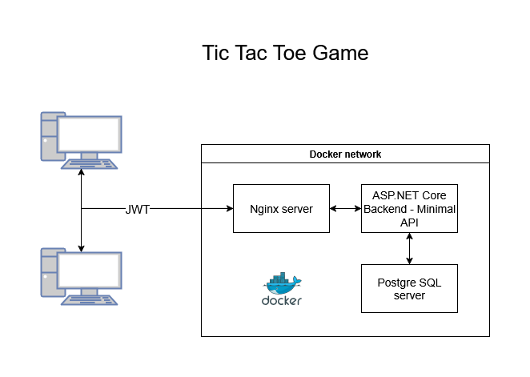

# Tic Tac Toe Online Game

This is an exercise in implementing a basic Tic Tac Toe application with support for multiple players.

Multiple users can sign up in the application and start request to start games with any of the other connected players.



After signing up and signing in the following page is presented to the user.



After selecting a user the player can request to start a game with another player by requesting to start a game with the selected player. The other player will receive a start game notification which can be accepted or refused. If refused, both players will remain on the dashboard page, and, if accepted, both players will load the game page and start playing.

## Architecture



## ASP.NET Core Backend Endpoints (Minimalist API)

- /signup
- /login
- /logout
- /me
- /connected-users

## Postgres Tables

- Users

| **Attribute**      | **Id**          | **Username**       | **PasswordHash**   | **Connected**     |
|--------------------|------------------|----------------------|----------------------|--------------------|
| **Type**           | `int`            | `string`             | `string`             | `bool`             |

- TODO: Games

## Frontend Pages

| **Page**      | **Purpose**          |
|---------------|----------------------|
| **index.html**    | login/signup page    |
| **dashboard.html**    |  page to start a game by requesting another user jo join    |
| **game.html**    | game page where players can make moves    |

## Remaining work

- [x] Login system
- [x] JWT authentication
- [ ] System to send and receive invites to another connected player - TODO: using WebSockets or SignalR
- [ ] Tic Tac Toe game page
- [ ] Configure https with frontend (only Nginx config?)


## Docker Commands

### Backend

* Build and start the backend container

```console
docker build -t tictactoe-backend ./backend
docker run --rm --name tictactoe-backend-container --network tictactoeproj_pg-network tictactoe-backend
```

* Run pgAdmin

```console
docker run --rm --network pg-network -p 8081:80 -e PGADMIN_DEFAULT_EMAIL=admin@example.com -e PGADMIN_DEFAULT_PASSWORD=admin dpage/pgadmin4
```

### Frontend and Postgres startup

```console
docker-compose up
```

### Debugging

Attach to the backend container after starting it.

### Other Docker commands - need to clean up

#### Frontend

* Build the image

```console
docker build -t tictactoe-frontend .
```

* Start the container from the image

```console
docker run -d -p 8080:80 --name tictactoe-frontend-container tictactoe-frontend
```

* Clean-up:

```console
docker stop tictactoe-frontend-container
docker rm tictactoe-frontend-container
```


* Start webserver directly:

```console
docker run --rm -d -p 8080:80 -v ${PWD}/frontend/public:/usr/share/nginx/html:ro nginx:alpine
```


dotnet new web -o tictactoe-backend


#### Backend

* Add the Entity Framework package

```console
dotnet add package Npgsql.EntityFrameworkCore.PostgreSQL
```

* Run to initialize the database

```console
dotnet add package Microsoft.EntityFrameworkCore.Design
dotnet ef migrations add InitialCreate
dotnet ef database update
```

```console
docker build -t tictactoe-backend ./backend

docker run --rm -d -p 5000:80 --name tictactoe-backend-container tictactoe-backend

docker run --rm -p 5000:8080 --name tictactoe-backend-container --network tictactoeproj_pg-network tictactoe-backend
```

#### Configure Postgres

* Create network and docker volume for persistent database storage

```console
docker network create pg-network
docker volume create pgdata
```

* Run Postgres

```console
docker run --rm --name my-postgres --network pg-network -e POSTGRES_USER=user -e POSTGRES_PASSWORD=user -e POSTGRES_DB=mydatabase -p 5432:5432 -d -v pgdata:/var/lib/postgresql/data postgres:15-alpine
````

#### Debugging

```console
docker-compose up

docker run --rm --name tictactoe-backend-container --network tictactoeproj_pg-network tictactoe-backend
```
